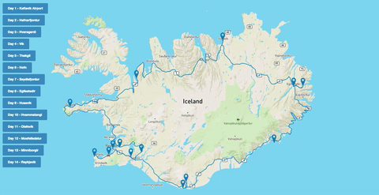
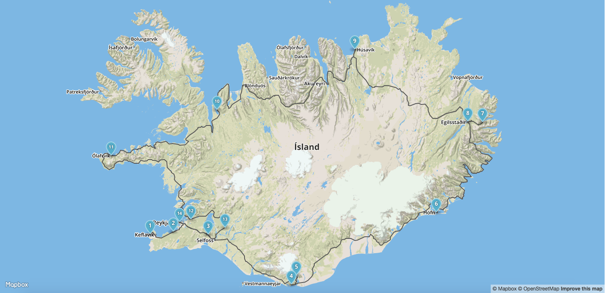
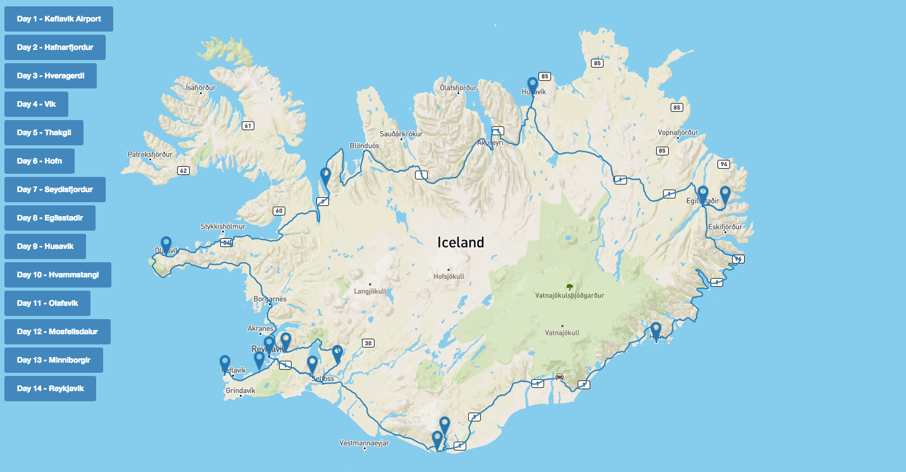

# flask_mapbox

Visualize route on map using Flask and Mapbox

Requirements
============

The python dependencies are managed using pip and listed in
`requirements.txt`

Setting up Local Development
============================

First, clone this repository:

    git clone https://github.com/kazuar/flask_mapbox.git

You can use pip, virtualenv and virtualenvwrapper to install the requirements:

    pip install -r requirements.txt
 
Make sure you have npm and bower installed on your machine (for javascript dependencies):

    bower install

Create `setting.py` file for the MAPBOX_ACCESS_KEY:

	MAPBOX_ACCESS_KEY = '<MAPBOX_ACCESS_KEY>'	

Start the server by running `start.sh`:

	sh start.sh

Browse to [localhost](http://127.0.0.1:5000) for the index page

[Mapbox JS page](http://127.0.0.1:5000/mapbox_js)

[Mapbox GL page](http://127.0.0.1:5000/mapbox_gl)

